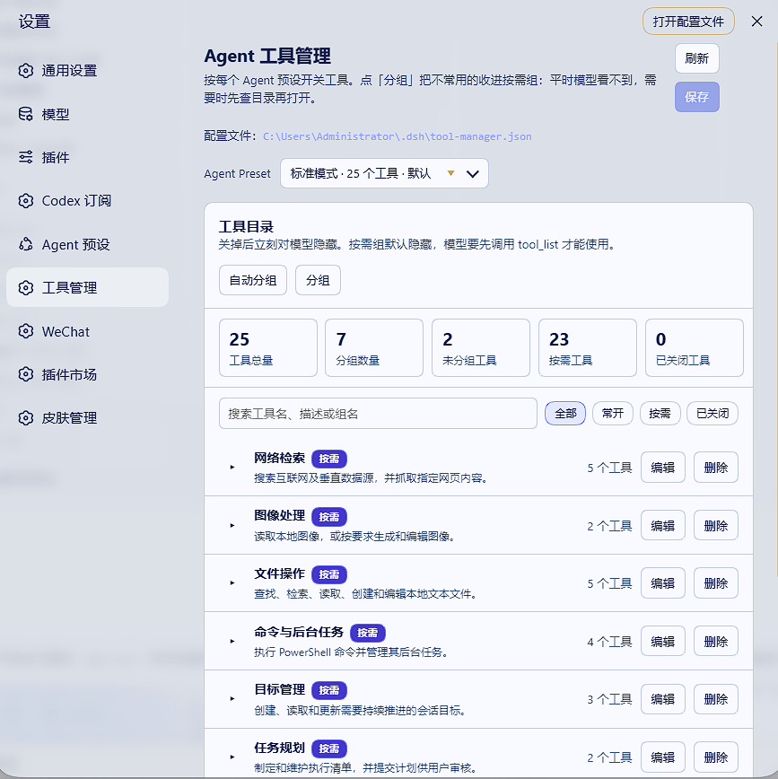

# DSH 工具管理插件

一个简单好用的 DeepSeek Harness（DSH）工具管理插件。

它可以帮你：

- 按 Agent Preset 开启或关闭工具；
- 把相关工具整理成分组；
- 像使用 Skill 一样，让低频工具按需加载；
- 减少模型平时看到的工具数量，让工具列表更清晰、更省上下文。



## 主要功能

### 开启或关闭工具

在 WebUI 中可以直接控制每个工具是否可用。

关闭后，该工具会同时从模型的工具列表中隐藏，并且不能被当前 Agent 调用。

不同 Agent Preset 可以使用不同的工具配置。

### 工具分组

你可以把用途相近的工具放进同一个分组，例如：

- GitHub 工具
- 文件处理
- 网页搜索
- 图片生成
- 数据分析

分组支持手动选择工具，也可以使用当前默认模型自动生成分组、名称和描述。调用模型前可以预览、编辑或重置提示词。

### 像 Skill 一样按需加载

放进按需组的工具默认不会全部出现在模型上下文中。

模型平时只会看到分组目录和一个 `tool_list` 工具。目录会列出每组实际包含的工具数量和完整工具名称，便于模型准确选择。当任务需要某组能力时，模型可以调用：

```json
{
  "group": "GitHub 工具"
}
```

该组中的原始工具随后会在当前会话中开放，模型可以继续使用它们。

按需加载具有以下特点：

- 工具按组开放，不需要逐个启用；
- 每个按需组必须至少包含一个当前可用且未关闭的工具，空组不能保存，也不会进入模型目录；
- 一个工具只能属于一个按需组；已分组或已关闭的工具不能再加入其他组；
- 开放后在当前会话中持续可用；重启 DSH 并恢复同一会话时，会根据该会话中成功的 `tool_list` 调用恢复开放状态；
- 不会影响其他会话；新建会话或从当前会话 fork 出来的子会话仍从默认隐藏状态开始；
- 工具仍以原来的名称和参数运行；
- 明确关闭的工具不会被按需组重新启用。

## 安装

```bash
npx @deepseek-ai/dsh plugin --profile web add dsh-tool-manager
```

安装完成后，重启对应的 DSH Profile。

然后打开 WebUI：

```text
http://127.0.0.1:3080
```

进入：

**设置 → 工具管理**

升级 / 卸载：

```bash
npx @deepseek-ai/dsh plugin --profile web update dsh-tool-manager
npx @deepseek-ai/dsh plugin --profile web remove dsh-tool-manager
```

## 使用方法

### 1. 选择 Agent Preset

在页面顶部选择需要配置的 Agent Preset。

每个 Preset 的工具策略相互独立。

### 2. 开启或关闭工具

在工具目录中勾选或取消勾选工具：

- 勾选：工具保持可用；
- 取消勾选：工具被关闭。

可以通过搜索和状态筛选快速查找工具。

### 3. 创建按需分组

点击“手动分组”，然后：

1. 填写分组名称；
2. 填写可选的分组描述；
3. 搜索并勾选要加入的工具；
4. 点击“确定”。

确认分组后，页面会保留当前筛选位置，不会自动跳转到“按需”页面。

你也可以点击“自动生成名称和描述”，让当前默认模型根据所选工具生成建议。执行前可以展开并编辑本次请求的提示词，也可以一键重置为根据当前选中工具生成的默认提示词。

### 4. 自动分组

点击“自动分组”后，可以先搜索、勾选本次需要整理的工具；插件只会把选中的尚未分组且未关闭工具交给当前默认模型。

执行前可以预览并编辑提示词；默认提示词会随工具勾选实时更新，自定义后也可以一键重置。自动生成的结果会先显示预览。确认后只会加入页面草稿，不会立即写入配置。

### 5. 保存修改

工具开关或分组发生变化后，页面会显示“有未保存的修改”。

点击“保存”后配置才会生效。运行中的 Agent 会从下一个模型步骤开始使用新策略。

如果在未保存时刷新页面或离开站点，插件会进行提醒，避免误丢草稿。

## 工具状态说明

页面会把工具分为三种状态：

| 状态 | 含义 |
| --- | --- |
| 常开 | 默认出现在模型工具列表中，可以直接调用 |
| 按需 | 默认隐藏，需要先通过 `tool_list` 打开所在分组 |
| 已关闭 | 不显示给模型，也不能调用 |

页面还会显示工具总量、分组数量、未分组工具、按需工具和已关闭工具等统计信息。

## 配置文件

配置默认保存在：

```text
$DSH_HOME/tool-manager.json
```

如果没有设置 `DSH_HOME`，默认位置为：

```text
~/.dsh/tool-manager.json
```

也可以通过环境变量指定其他路径：

```text
DSH_TOOL_MANAGER_CONFIG
```

示例配置：

```json
{
  "presets": {
    "standard": {
      "disabled": [
        "codex_image_generate"
      ],
      "groups": [
        {
          "name": "GitHub 工具",
          "description": "处理 GitHub Issue 和仓库内容",
          "patterns": [
            "mcp__github__create_issue",
            "mcp__github__list_issues"
          ]
        }
      ]
    }
  }
}
```

通常不需要手动编辑这个文件，直接在 WebUI 中操作即可。

## 需要注意

- 插件管理的是模型能否看到和调用工具；
- 它不会停止工具所属的 Cordis 插件或 MCP 服务进程；
- 修改配置不会改写 DSH 自带的 Agent Preset 文件；
- 按需开放只对当前 Agent 会话生效；
- 自动命名和自动分组会调用当前默认模型，因此会产生一次模型请求；执行前的确认框可预览和编辑提示词，并可分别设置 5–600 秒超时，默认分别为 60 秒和 120 秒；插件不限制提示词/请求体大小、工具或分组数量、名称/描述长度、模型返回文本长度及输出 Token，实际可用范围仍由当前模型、供应商和运行环境决定。

### 关于“某个会话缺少 preset 工具”

DSH 自身存在一个组合切换竞态：切换模式时，旧 composition 的按 Agent 工具注册是**异步**拆除的，而新 composition 会在同一次 `tools/change` 里抢着注册同名工具；谁先落地由监听器注册顺序（≈ Preset 的 mount 顺序）决定。撞名失败后，DSH 会把这次失败**永久记住**，该 Agent 在重建之前都拿不到这些工具。典型触发是“重启后先恢复了一个非默认模式的旧会话”，于是之后“新建会话 → 切到该模式”都会中招。

- 这**不是**本插件的开关或目录探测造成的：出问题的会话里对应 Preset 的 `disabled` 是空的，也不存在包含这些工具的按需分组；
- 本插件有两层处理：① 加载时先组合默认 Preset，且由插件发起的挂载都排在它之后，不让插件把顺序弄反；② **通用自愈** —— 每次模式切换之后，插件会把这个会话借另一个 Preset 空转一圈再切回目标 Preset，让目标 composition 在一个“没有同名注册”的 Agent 上重新安装。这一层**不认工具名**：丢的是谁家的工具、丢了几个，都走同一条路径修好；
- 自愈只对**还没开始对话的空白会话**执行（DSH 本身也只允许空白会话切换模式），因此没有可损失的内容；已经开始的会话不会被改动，插件会在日志里点名缺了哪些工具并提示重开；
- 自愈成功时日志里会出现一条自我报告：`... lost N tool(s) on the switch to preset "..." — ... — and re-calibration restored them.`；
- 完整分析、证据与上游修复建议见 [docs/composition-switch-race.md](docs/composition-switch-race.md)。

## 开发

```bash
npm install
npm run build
npm test
```

## 许可证

MIT
